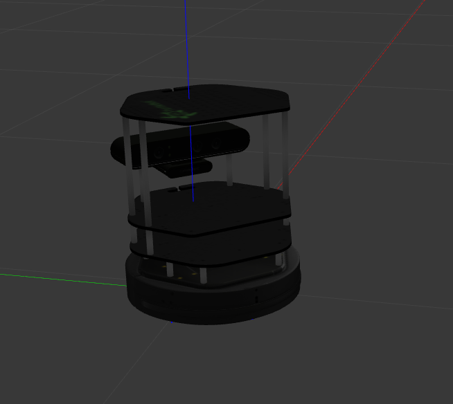
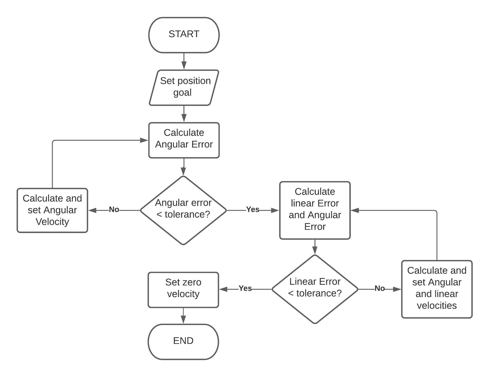
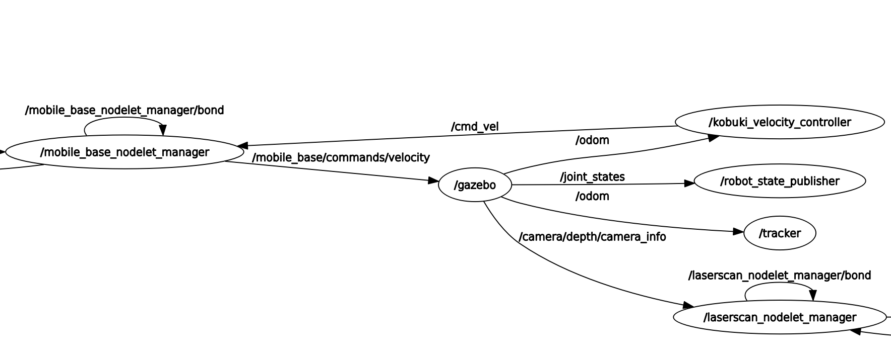
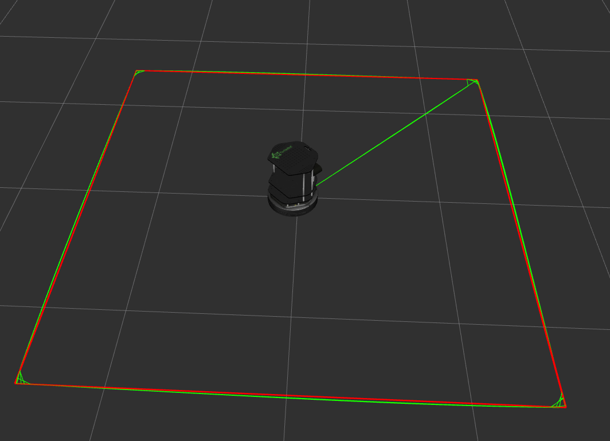
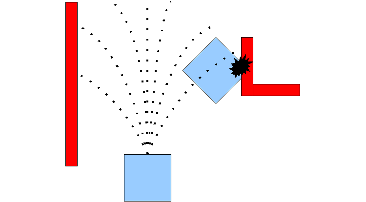
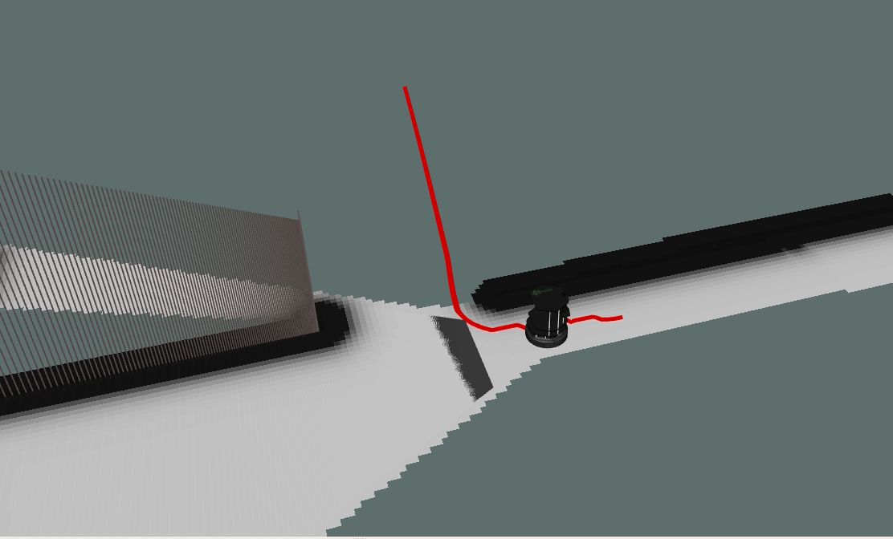
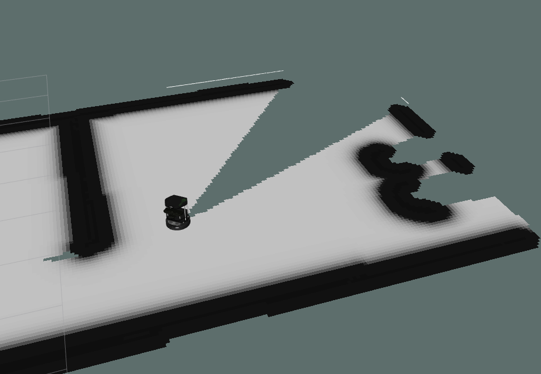
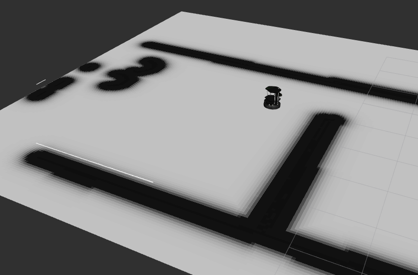
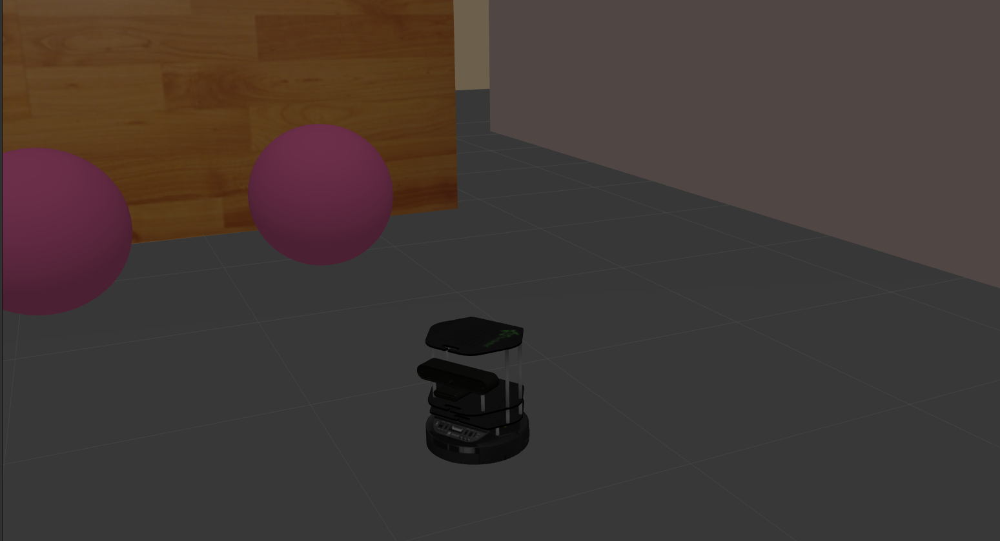

# TorHando Gazebo Simulation Summary

Simulation results are integral to the success of any project. Gazebo provided a suitable plaform to test navigation algorithms with varying levels of autonomy in a risk free way. These simulations also increased the time efficiency of implementing the same algorithms on the real-life hardware present in the Robotics Lab of the Mechatronics Department.

  

    Fig: Turtlebot 2 model used for simulation purposes

## Levels of autonomy
To understand the nature of this project, one must first be familiarized with the concept of 'levels of autonomy'. There are 6 levels of autonomy associated with mobile robots. 

1. **Level 0** - No automation: At this level of automation the operator performs and is responsible for all robot tasks.

2. **Level 1** - Operator Assistance: The robot has the capability to control either steering or acceleration under certain circumstances to assist the operator.

3. **Level 2** - Partial Automation: The robot completes certain tasks without intervention upon request by the operator. The operator has to resume manual control if any unforeseen situation is encountered.

4. **Level 3** - Conditional Automation: Similar to level 2, the robot assumes full control during certain phases of operation with the difference being the provision for certain intervention actions.

5. **Level 4** - High Automation: Robots employing this level of autonomy have the ability to follow a particular trajectory while actively modifying the path to be followed to handle exceptions such as obstacles and barriers.

6. **Level 5** - Full Automation: The entire operation of the robot is completely free from manual intervention. The robot has to calculate goal states and trajectories to best achieve the required tasks while handling any unaccounted situations.

Levels 2 and 4 are successfully implemented in the project simulations.

---
## Level 2 Autonomy

### Aim
Design and implement a closed loop position controller for the Kobuki Turtlebot 2. Plot and analyse deviation from ideal trajectory.

### Algorithm

  

    Fig: Algorithm for closed loop position control.

### Nodes
The **position controller** node uses PI gains for linear motion and P gain for angular motion. The node receives position feedback from wheel odometry and publishes planar twist messages to the desired velocity topic.
The **position tracker** node subscribes to wheel odometry and publishes the path taken by the robot as well as the ideal Trajectory to RVIZ for visualization.

  

    Fig: Rqt Graph of nodes.

### Results
A 3m x 3m square trajectory was completed 10 times by the robot with minimal diversion.

  

    Fig: Simulation results visualized. Ideal Trajectory. Actual Trajectory.

---
## Level 4 Autonomy
### Aim
At this stage the robot is expected to autonomously navigate an obstacle filled environment towards a designated goal state.

### Approach
The ROS package **move_base** is used to preform this task. In order to enable environment perception the onboard RGBD camera is used. The move_base package provides both a local and global path planner.

### Move_base
This package provides the move_base ROS node which is a major component of the overall ROS navigation stack. This node creates and maintains both a local and global costmap that is updated according to sensor values and costmap parameters. A global and local planner is responsible for path planning and publishing velocity messages to the robots hardware. 

  

    Fig: Move base node overview

### Local Planner
The local planner used in the simulation is the **Dynamic Window Approach** (DWA) planner. When provided with a global trajectory and a costmap of the environment the planner output velocity commands to follow the given global path. 

  

    Fig: dwa local planner

Algorithm Description:

1. The control space of any planar mobile robot consists of x and y axes velocites as well as angular velocity about z axis. The planner will first take random samples from this set constrained by user defined limits on velocity and acceleration.

2. For each sample taken, a forward integration is performed over a fixed period of time to predict the kinematic outcome of applying the velocity sample. 

3. Each trajectory generated in the above step is evaluated based on proximity to obstacles, proximity to the goal, proximity to the global path, and speed. Trajectories are immediately discarded if they intersect/collide with any obstacle.

4. The highest scoring trajectory is selected and its velocity sample(Vx, Vy, Vtheta) is published to the mobile robot base.

5. Clear values and repeat until goal state is achieved.

### Global Planner
The global planner functions as a trajectory generator. When given a current and final configuration in the global fixed frame the planner will compute a trajectory of robot configurations that has the minimum cost of achieving the goal state. The global planner used in the simulation is the **navfn** planner. This planner uses an implementation of djikstras shortest path algorithm that assumes a circular footprint for the robot for improved peformance. The algorithm also interpolates intermediate robot states for reduced computation.

  

    Fig: Global path 

### Costmaps

A costmap is essentially an occupancy grid where each grid cell is assigned a value depending on the proximity to obstacles. The costmaps generated by move_base are 2 dimensional. Seperate costmaps exist for global navigation and local planning. Obstacles are inflated using user defined radii.

  

    Fig: global costmap

  

    Fig: local costmap

### Results 
Level 4 Autonomy was achieved in an obstacle filled environment. If given a start pose and an end pose, the robot will autonomously navigate to the designated target while avoiding obstacles.

  

    Fig: final navigation

## References
https://stanley-robotics.com/blog/the-different-autonomous-level-for-industrial-robotics-you-need-to-know/

http://wiki.ros.org/dwa_local_planner

http://wiki.ros.org/move_base